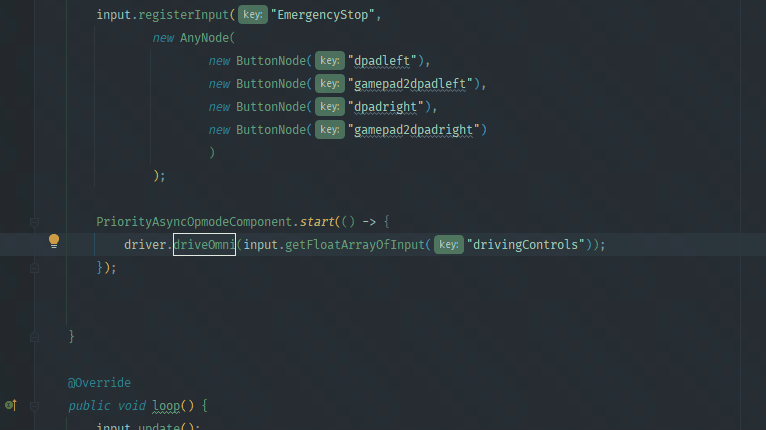
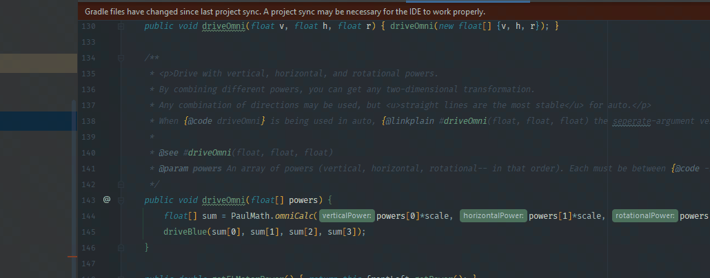
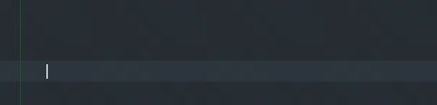
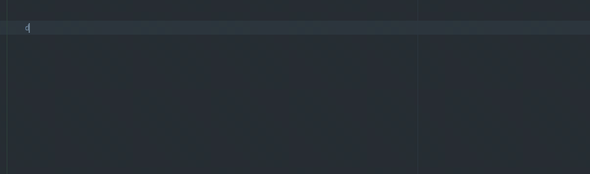
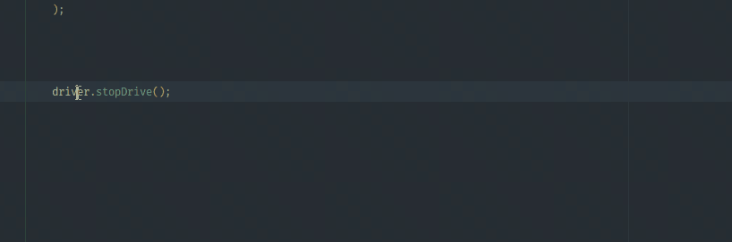
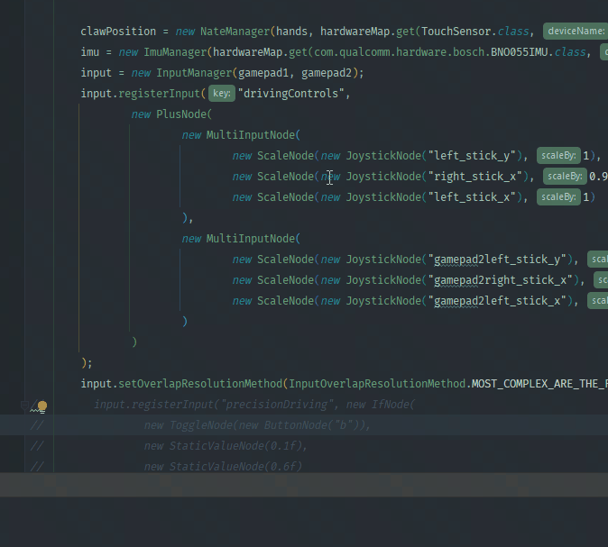
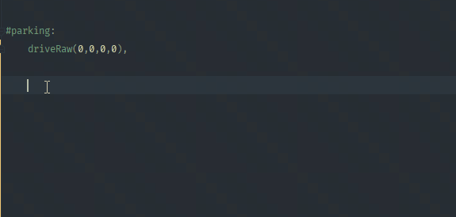

# Keyboard Shortcuts

## ⭐ Go to Definition: `CTRL` + `B`

Put your text-cursor on a symbol (class, method, or variable). Pressing CTRL + B will jump to the *definition* of that symbol. If you're on the definition, CTRL+B will show a list of *uses*.

## ⭐ Open File or Symbol: `SHIFT` + `SHIFT` (double-shift)

Double-shift opens a menu where you can search for classes, files, or methods. It is *very* useful, since you only need to know the name of what you want.

## Show Parameters: `CTRL` + `P`

When you are typing a method, Show Parameters tells you what the parameters are.

## ⭐ Show Documentation: `CTRL` + `Q`

Put your text-cursor on a symbol (class, method, or variable). Pressing CTRL + Q will show you the Javadoc on how to use it.

## Rename Symbol: `SHIFT` + `F6`

Put your text-cursor on a symbol. SHIFT + F6 will safely rename it, making sure that the definition and all references are changed.

## Search in All Files: `CTRL` + `SHIFT` + `F`

CTRL + SHIFT + F can search for a search term in *every* file. This is different from double-shift: while double-shift searches *file names*, Search-in-all-files searches *file contents*.

## Request Autocomplete: `CTRL` + `SPACE`

Autocomplete will automatically appear when you type something. If you want to request it *right away*, then you can type `CTRL` + `SPACE`. This is especially helpful for Autoauto, where you don't have to use the manager's name to call a method!

