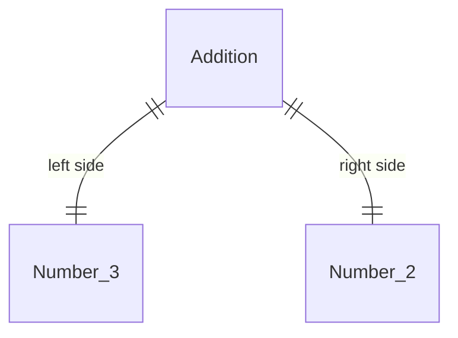

# How the Compiler Works

Autoauto's compiler is written in Javascript, using Node.js. 


- [How the Compiler Works](#how-the-compiler-works)
  - [Modding `build.gradle`](#modding-buildgradle)
  - [What it Does](#what-it-does)
  - [Caching](#caching)
  - [Logging](#logging)

## Modding `build.gradle`

In order to make Android Studio (java) run the Autoauto compiler (javascript), we have a customized Gradle build script in the `TeamCode` folder. Here are the customizations necessary-- __most of these should be applied already, but if Autoauto isn't updating, check on them.__

> ```gradle
> plugins {
>      id "com.github.node-gradle.node" version "3.0.1"
> }
> ```
> *Added at the very top of the file. If there is already a `plugins` block, add the middle line to the __end__ of that block.*

> ```gradle
> task autoautoCompiler(type: NodeTask) {  
>    args = ["--build-history"]
>    script = file("src/main/scripts/autoauto-compiler/index.js")  
> }
> ```
> *Added at the end of the file.*

> ```gradle
> android {  
>   gradle.projectsEvaluated {  
>        preBuild.dependsOn(autoautoCompiler)  
>    }
>    sourceSets {  
>        test {  
>            java.srcDir("gen/")  
>            java.srcDir("src/test/java")  
>        }
>        debug {  
>            java.srcDir("gen/")  
>            java.srcDir("src/test/java")  
>        }
>        main {  
>            java.srcDir("gen/")  
>        }
>    }
> }
> node {  
>    download = true  
>    version = "12.18.3"  
>    distBaseUrl = "https://nodejs.org/dist" 
> }
> ```
> *Added at the end of the file*

### What do the `build.gradle` changes do?

These modifications tell Gradle four things:
- This build needs to use Node.js
- `generateAutoautoSources` calls the given file with Node.js
- Before building the app, call `generateAutoautoSources`.
- If the computer doesn't have Node.js, download it.
- The `gen` and `test` folders should be used for Java.

## What it Does

Once Gradle calls Autoauto's compiler, the compiler needs to **load files**, **compile them**, and **write the output**.

> **A Quick Note on File Paths**
> From here, file paths are relative to the `TeamCode/src/main/scripts/autoauto-compiler` folder.

For efficiency, the whole `index.js` of `autoauto-compiler` is an [async function](glossary#Async%20Function). It calls `compiler/index.js`, which does the actual work.

Compiling files is easily parallel. You can have one thread for each file, compile them all at the same time, and quickly finish all of them, but Javascript wasn't built for multi-threading. Pseudo-multithreading is easy (async functions); real multithreading is *doable*, but *difficult*.

To make it easier, the compiler uses a "pool": a certain number of threads (8, by default) handle compilation. If every thread is busy, files go into a queue and get compiled by the first free thread. That way, the computer isn't overwhelmed by Javascript's inefficient threads.

Before giving a file to the queue, the compiler needs to find it; this phase is called Loading Files.

### Loading Files

Loading Files (and everything after it) is handled by `compiler/index.js`'s `compileAllFromSourceDirectory` function. It needs to look for Autoauto files in the `SRC_DIRECTORY` (a constant for the `TeamCode/src` folder)

It uses a `folderScanner` to scan the `SRC_DIRECTORY` for files ending with ".autoauto". The folder scanner will immediately resolve a file when it finds it, so the compiler doesn't have to do a slow load-then-loop (see fig. #1).

```mermaid
gantt
title Figure 1
dateFormat X
axisFormat   

section Slow loop
Load 1, 2, 3 :s1, 0, 9s
Compile 1, 2, 3 :s2, after s1, 15s

section Immediate
Load 1:i1, 0, 3s
Compile 1:ic1, after i1, 5s
Load 2:i2, 3, 3s
Compile 2:ic2, after i2, 5s
Load 3:i3, 6, 3s
Compile 3:ic3, after i3, 5s
```



After loading a file, the `compileAllFromSourceDirectory` function passes it over to `makeContextAndCompileFile`, which handles the actual compilation.

### Compiling Files

Each file has a "file context": an object that represents its compilation process. The file context includes: 
- Source file content
- Source file address 
- Result file address (where the Java class file goes)
- Transmutations (the steps that this file needs in order to be compiled).

When compilation starts, it only has a `string` of the file address, so it needs to make the file context; the `makeFileContext` function does this. After making a file context, everything else is determined by the file's transmutations.

#### Transmutations

Some files need to be compiled differently. Some options include:
- Compile faster, but run the program slower
- Compile slightly slower, but with more checking, safety, and optimization
- Compromise by skipping safety checks

To do this easily, compiler functionality is split up into **transmutations**. Transmutations live in the `compiler/transmutations` folder.

Each transmutation has an `index.transmute-meta.js` file (which defines metadata) and an `index.js` file (its code, which is *ran once for each file that requests it*). **Making a new transmutation is easy: just make a folder with those two files.**

Here's what an `index.transmute-meta.js` file looks like:

```js
module.exports = {
    requires: ["make-runtime-flag-setters", "text-to-syntax-tree", "get-json-outline-java", "get-result-package"], //transmutations that need to be ran first
    id: "process-template", //the unique ID that identifies this transmutation
    type: "information", 
    readsFiles: [__dirname + "/file.txt"] //any files that this transmutation depends on. This can be left blank ([]) if it doesn't read any files.

}
```

The complete schema for an `index.transmute-meta.js` file is in `compiler/transmutations/index.js`, under `@typedef {object} Transmutation`.

An `index.js` transmutation file **must** export a function, like so:

```js
module.exports = function run(context) {
    
}
```

The `context` parameter is a `TransmutateContext`, as defined in `compiler/transmutations/index.js`. `run()` **must** do two things:
- Set `context.status` to `"pass"`. If this isn't done, then the compiler will assume that it errored.
- Set `context.output` to an output. This output will be available to the next transmutations by accessing `context.inputs["*transmutation ID, defined in index.transmute-meta.js*"]`. The output should *not* include functions, since it will be cached.

It *may* do some other things:
- Write files with `context.writtenFiles["full file address"] = "file content"`. Writing files is an IO-bound task, so it's handled in one "lazy bundle" at the end. 
- Access old transmutations' outputs! `context.inputs` is an array of all old inputs; you can use `context.inputs["transmutation id"]` to access it.

##### Alias Transmutations

Alias transmutations are a special type of transmutation. They *don't* have to have an `index.js` file; instead, they "alias" to other transmutations. Here is an example of an alias's `index.transmute-meta.js` file:

```js
module.exports = {
    requires: [],
    id: "optimized-bytecode",
    type: "alias",
    aliasesTo: "get-syntax-tree tree-check* syntax-tree-to-bytecode bcoptim-setup bytecode-flatten bytecode-into-java process-template write-to-output-file"
}
```

The `aliasesTo` property is interpreted exactly the same as [the `compilerMode` frontmatter](#Frontmatter%20Selecting%20Transmutations).

##### Codebase Tasks

There are two __special transmutation types__: `codebase_postprocess` and `codebase_preprocess`. They don't run on any file, but instead, on the whole codebase.

If a transmutation's `transmute-meta.js` defines it as `codebase_preprocess` or `codebase_postprocess`, it must export a *different* function:
```js
module.exports = function run(context, contexts) {

}
```

Like normal, codebase types must set `context.status = "pass"`. That's the only similarity, though-- here are the 
differences:
- `codebase_postprocess` does not have to set an output. If it does, the output is ignored.
- `codebase_preprocess`'s outputs are available to every transmutation in every file. 
- `codebase_preprocess` gets an empty array for `contexts`.
- `codebase_postprocess` gets an array of each file's `TransmutateContext` for `contexts`


#### Frontmatter Selecting Transmutations

Every Autoauto file may have **frontmatter**, which is enclosed in dollar-signs at the start of the file:

```aa
$
key: "value",
anyValuesAreAllowed: 3423.023,
butNotFunctions: //Math.sin(pi) will cause errors
$
```

The most important frontmatter key is `compilerMode`, which defines the transmutations to compile:

```aa
$
compilerMode: "get-syntax-tree syntax-tree-to-bytecode bytecode-into-java process-template write-to-output-file"
$
```
Different transmutations should be separated by spaces, but the **compilerMode is one string, *not* an array**.

"Globs" can be used: `bcoptim-*` refers to all transmutations that start with "`bcoptim-`".

## Caching 

Compiling every file, every build? That's slow. It's *way* quicker to **cache** by remembering the build output for a file. 

The compiler remembers the file's output by assigning it a **cache key**. The cache key is generated by `makeCacheKey(fileContext, preprocessInputs)`, and it depends on several things:

- The content of the file 
- The output of each `codebase_preprocess` transmutation
- The content of each file that the transmutation reads
- The `CACHE_VERSION` (defined in `config.js`)
- The transmutations that are being ran
- The full file address

If any of these change, then the cache is invalidated, and the file is re-compiled.

The cache's specifics are handled by a separate module, `cache`. It uses a special algorithm called `structured-serialise`, which can save almost anything to a file.

## Logging

Android Studio makes the compiler use a weird JSON format called "AGPBI". I assume that stands for something, but I don't know what.
You should never have to deal with it directly, but here is the format: 
```js
{
      "kind":"ERROR", //ERROR, WARNING, or INFO
      "text":"title text",
      "original":"detail text",
      "sources": [{ //optional
          "file":"/path/to/source.java",
          "position":{
              "startLine":1,
              "startColumn":2,
              "startOffset":3,
              "endLine":4,
              "endColumn":5,
              "endOffset":6
          }
      }]
  }
```
It should be logged to `stderr`, prefixed by `AGPBI: `.

To help with logging, the compiler has a module called `android-studio-logging`, which provides several functions!
- `sendTreeLocationMessage` parses a thing and sends it. The thing can be a string, an error, an object like above, or an array of objects like above.
- `sendPlainMessage` can *only* send an object like above.
- `warning` sends a string as a warning.
- `beginOutputCapture` stops sending messages, and instead records them to an array.
- `getCapturedOutput` stops capturing messages and returns an array of the messages that were captured.
- `sendMessages` works like `sendPlainMessage`, but on an array.
- `printTypeCounts` logs how many errors, warnings, and info-messages have been printed.

## Bytecode and Why it's Cool

Autoauto has had **three** main versions:

| |v0|v1|v2|
|-|-|-|-|
|Environment|Ran Entirely in Java|Recursive Descent Evaluation|Bytecode|
|Speed|Slow! Parser had to parse code from `String`s|pretty slow|Quicker|

### What's a Recursive Descent Evaluator?

RDEs are simple programming-language environments. They get a "parse tree" like this one for `3 + 2`:



From that, they do these things in this order:

1. Run `Addition`
2. Find out that `Addition` needs two arguments
3. Run the left side
4. Get a value from the left side
5. Run the right side
6. Get a value from the right side
7. Add the two values
8. Return the sum

In Autoauto v1 (used in the 2021-2022 season), the compiler made "Java soup", which was ran by a complex Java runtime program. This was slow because `n * log(n)` Java operations were needed for just `n` Autoauto operations. Everything that it did needed to be visited loaded from the tree before being run! Although Java made that loading pretty easy to code, it wasn't efficient.

### What's a Bytecode?

Bytecode is a different programming-language environment. Instead of having to visit a parse tree for *every* run, bytecode uses a thing called a "stack".

For `3 + 2`, here's what the bytecode looks like:

```sql
3
2
ADD
```

...and here's what it has to do:

1) Run `3`: add 3 to the stack.
2) Run `2`: add 2 to the stack
3) Run `ADD`: 
	1) Take two things off the stack
	2) Add them together
	3) Push the sum back onto the stack.

On average, this only has to do `n` Java operations for `n` Autoauto operations. It's *far* more efficient than a recursive descent.

Bytecode is a complex and hard-to-explain topic, and this document is *not* long enough to cover it. Robert Nystrom's amazing book *Crafting Interpreters* (free as a blog post on his website) has [a section on this topic](https://craftinginterpreters.com/chunks-of-bytecode.html#bytecode). The Wikipedia articles on [bytecode](https://en.wikipedia.org/wiki/Bytecode) and [stack machines](https://en.wikipedia.org/wiki/Stack_machine) are also very helpful and descriptive.

### Which Version is "Now?"

The current "default" is `optimized-bytecode` (v2), but people can use `compilerMode: "recursive-descent-java"` to request v1. 

### What instructions does Autoauto bytecode use? How does it work?

See <https://github.com/nhs-t10/autoauto-documentation/blob/master/md/bytecode.md> :)


### "Faster"? How much? Is it worth it?

Here's a benchmark! The task was to calculate every prime number under 1000 (the source is [here](https://github.com/nhs-t10/Robotics_2021_2022/blob/664afb74ac0e0d4f345f3f290988cc5fe8988b71/TeamCode/src/main/java/org/firstinspires/ftc/teamcode/opmodes/auto/bccomp/eratosthenes.autoauto))

|Version|Time (ms)|Notes|
|-|-|-|
|v0|n/a|didn't have support for tables; couldn't run|
|v1|180000ms +|I stopped it after 3 minutes|
|v2|524ms|


