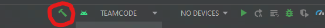

# From Boot to Build

## Installing Android Studio

If Android Studio **Bumblebee** or higher is installed, you can skip this step. To determine the version, go to [determining-version](../android-studio/determining-version.md)

Follow Android Studio's [official documentation](https://developer.android.com/studio/install) for instructions on how to install. Note that school Chromebooks **cannot** run Android Studio: the ChromeOS instructions on that page require Linux.

On Linux, instead of unzipping to `/usr/local` or `/opt`, you can just unzip the file to your Desktop. Then, open a terminal with `CTRL` + `ALT` + `T` and run Android Studio with the command "`~/Desktop/android-studio/bin/studio.sh`".

## Installing Git

Follow the [official documentation](https://git-scm.com/book/en/v2/Getting-Started-Installing-Git) for instructions on how to install Git. 

On Linux, use `CTRL` + `ALT` + `T` to open a terminal, and then type:
```bash
sudo apt update
sudo apt install git
```

## Cloning the Repository

> ⚠️ **Some operating systems allow you to clone from Android Studio. This guide ignores this, as most Mac computers can't do it.**

Once you've installed Git, you need to clone (a.k.a. download) the repository. The repository has all of the code you'll need.

Open a terminal. On Windows, this means launching `Windows Powershell`. On Linux, this means launching `Terminal` (or `CTRL` + `ALT` + `T`). On Mac, this means launching `Terminal`.

Get the Repository URL from your software manager.

Enter this command, replacing "URL" with your Repository URL.

```bash
git clone URL
```

This command may take a while to run. That is okay.

## Opening the Project in Android Studio

Run Android Studio. On Mac and Windows, you can use the system search interface to launch it. On Linux, open a terminal (`CTRL` + `ALT` + `T`) and enter `~/Desktop/android-studio/bin/studio.sh`.

Click the "OPEN" button. On Mac, you may need to use `FILE` + `OPEN` on the menu bar.

Select the project folder! On all systems, the last folder is the same: the *projectName*, which is based on the Repository URL. 

On Mac and Linux, the folder is `/home/`*username*`/`*projectName*.

On Windows, the folder is `C:\Users\`*username*`\`*projectName*.

Click "Open", and it will open. This may take a bit.

After it is open, you can use the Android Studio terminal (click the "Terminal" button on the bottom of the window) instead of the platform's terminal.

## Downloading SDKs and Agreeing to Legal Things

*Many* things have been automated for you in the next step. However, license/terms-of-service agreements can't be legally automated.

To download the Android SDK, click `File` on the [glossary](../glossary.md#Menu%20Bar). Then, click `Settings`.

In the Settings popup, go to `Appearance and Behavior` > `System Settings` > `Android SDK`.

This is the **SDK Manager**. We're going to install several SDKs, but Android Studio might need others: we might need to come back here later. That's okay.

Under the "SDK Platforms" tab, look in the second column (API Level). Check the checkboxes next to API Levels "29", "30", and "31". Go to the "SDK Tools" tab.

In the "SDK Tools" tab, check the checkboxes next to 
Android SDK Tools", "Android SDK Platform-Tools", "NDK (side by side)", and "Android SDK Build-Tools".

Click the "Apply" button, then the "OK" button. This will open a wizard to help you install the Android SDK. Agree to the user licenses and terms-of-service-s; just keep pressing the "Ok"/"Next" button. 

This download might take *hours* to finish. That is okay and expected.

## Building

After the SDK Manager has finished doing its thing, you can exit it. Click the green hammer button at the top of the screen to run your first build! 


If there are any errors, ask your software manager. 

## Next

Next, follow [first-commit](first-commit.md) to make sure you can change the code and upload changes.
